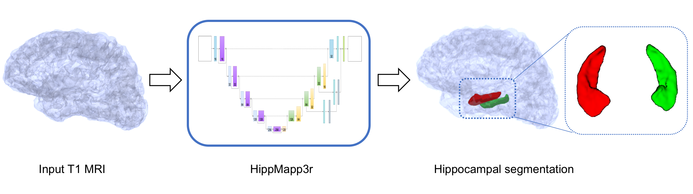

# DASH3R

Deep Automated Segmentation of the Hippocampus in 3/thRee dimensions (pronounced dasher)

*DASH3R* is a CNN-based segmentation technique of the whole hippocampus
using MRI images from BrainLab

      

____________________________

For more details, see our [docs](https://dash3r.readthedocs.io).

