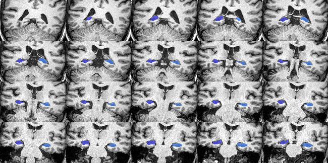

# Getting started

You can use DASH3R through the graphical user interface (GUI) or command line:

## For GUI

To start it type

    dash3r

You can hover any of buttons in the GUI to see a brief description of the command.

      

You can get the command usage info by click the "Help" box on any of the pop-up windows.

      

## For Command Line

You can see all the dasher commands by typing either of the following lines:

    dash3r -h
    dash3r --help

Once you know the command you want to know from the list, you can see more information about the command. For example, to learn more about seg_hfb:

    dash3r seg_hipp -h
    dash3r seg_hipp --help

## Hippocampal volumes
To extract hippocampal volumes use the GUI (Stats/Hippocampal Volumes) or command line:

    dash3r stats_hp -h

## QC
QC files are automatically generated in a sub-folder within the subject folder.
They are .png images that show a series of slices in the brain to
help you quickly evaluate if your command worked successfully,
especially if you have run multiple subjects.
They can also be created through the GUI or command line:

    dash3r seg_qc -h

The QC image should look like this:

      

## Logs
Log files are automatically generated in a sub-folder within the subject folder.
They are .txt files that contain information regarding the command
and can be useful if something did not work successfully.

## File conversion

Convert Analyze to Nifti (or vice versa)

    dash3r filetype

    Required arguments:
    -i , --in_img    input image, ex:MM.img
    -o , --out_img   output image, ex:MM.nii

    Example:
    dash3r filetype --in_img subject_T1.img --out_img subject_T1.nii.gz

