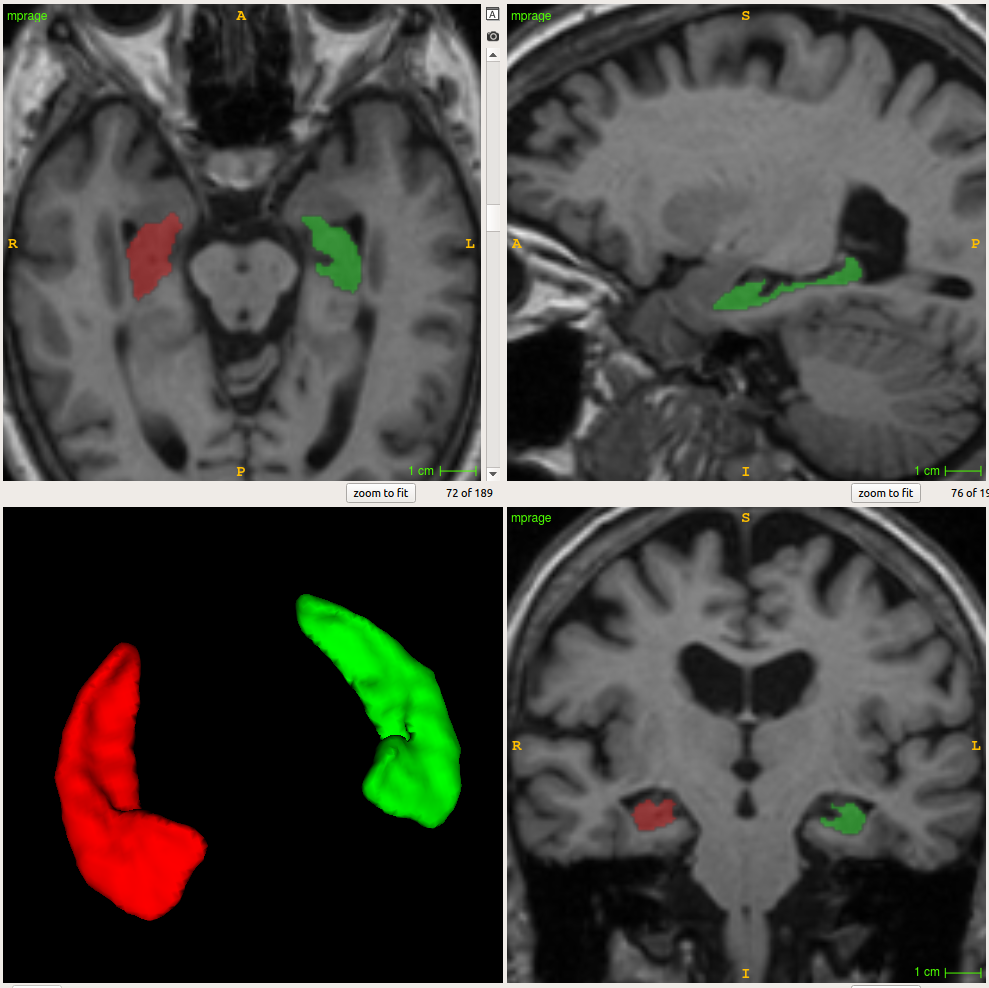

# Segmentation tutorials

## GUI

Watch this video tutorial:

-----

Or follow this step:

Click "Hippocampus" under the "Segmentation" tab. Wait for a new pop-up window to appear.

      

Click "Select t1w" and chose your T1 image. Click "Run".
Type your desired output name in the "out" box.
Your output file will automatically appear in your t1w folder.

## Command Line

    dash3r seg_hipp
    
    Optional arguments:
    -s , --subj       input subject
    -t1 , --t1w       input T1-weighted
    -b, --bias        bias field correct image before segmentation
    -o , --out        output prediction
    -f, --force       overwrite existing segmentation
    -ss , --session   input session for longitudinal studies
    
    Examples:
    dash3r seg_hipp -s subjectname -b
    dash3r seg_hipp -t1 subject_T1_nu.nii.gz -o subject_hipp.nii.gz

The output should look like this:

      

