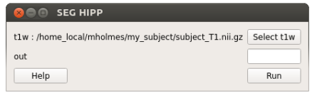

# Segmentation tutorials

## GUI

Watch this video tutorial:

-----

Or follow the steps below:

After opening the HippMapper GUI, click "Hippocampus" under the "Segmentation" tab. Wait for a new pop-up window to appear. The window should look like the image below.

Click "Select t1w" and chose your T1 image. Click "Run".
Type your desired output name in the "out" box.
Your output file will automatically appear in your t1w folder.

## Command Line

    hippmapper seg_hipp
    
    Optional arguments:
    -s , --subj       input subject
    -t1 , --t1w       input T1-weighted
    -b, --bias        bias field correct image before segmentation
    -o , --out        output prediction
    -f, --force       overwrite existing segmentation
    -ss , --session   input session for longitudinal studies
    
    Examples:
    hippmapper seg_hipp -s subjectname -b
    hippmapper seg_hipp -t1 subject_T1_nu.nii.gz -o subject_hipp.nii.gz

The output should look like this.:

