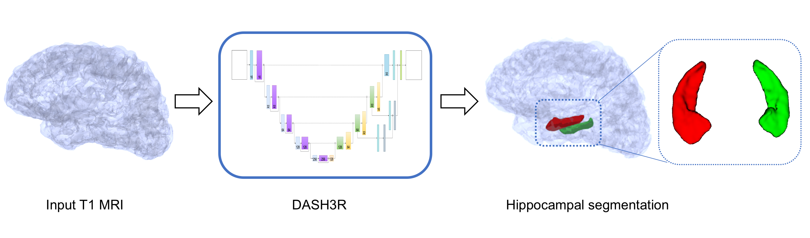

.. DASH3R documentation master file, created by
   sphinx-quickstart on Fri Dec 14 15:34:18 2018.
   You can adapt this file completely to your liking, but it should at least
   contain the root `toctree` directive.

Welcome to DASH3R's documentation!
==================================

Deep Automated Segmentation of the Hippocampus in 3/thRee dimensions (pronounced dasher)

*DASH3R* is a CNN-based segmentation technique of the whole hippocampus
using MRI images from BrainLab.
It can deal with brains with extensive atrophy and segments the hippocampi in seconds.
It uses a T1-weighted image as the only input and segments both with-skull and skull-stripped images.

.. toctree::
   :maxdepth: 2
   :caption: Contents:

   install
   beginner
   hipp_seg
   issues
   docker

Indices and tables
====================

* :ref:`genindex`
* :ref:`modindex`
* :ref:`search`
